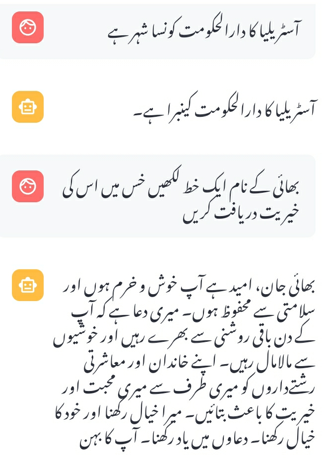

# Urdubot

A chatbot demo allowing users to converse with the bot and get responses in Urdu.

## Local Setup
1. Clone repo:
    ```
    git clone https://github.com/saqadir/urdubot.git
    ```
2. Navigate into the urdubot directory 
3. Create environment:
    ```
    python3 -m venv urdubot
    ```
4. Activate environment:
    ```
    source urdubot/bin/activate
    ```
5. Install dependencies:
    ```
    pip install -r requirements.txt
    ```
6. Setup OpenAPI key:
    - Create a .streamlit/secrets.toml file
    - Add the following secret in the file
        ```
        OPENAI_API_KEY = "YOUR_API_KEY"
        ```
7. Run the application:
    ```
    streamlit run main.py
    ```
8. The app will open up in your local browser. 
## Demo

[](https://urdubot.streamlit.app)

### Conversation Samples




## References and Tutorials

- [Building conversational apps with Streamlit](https://docs.streamlit.io/knowledge-base/tutorials/build-conversational-apps)

- [Deploying your app on the Streamlit Community Cloud](https://docs.streamlit.io/streamlit-community-cloud/deploy-your-app)